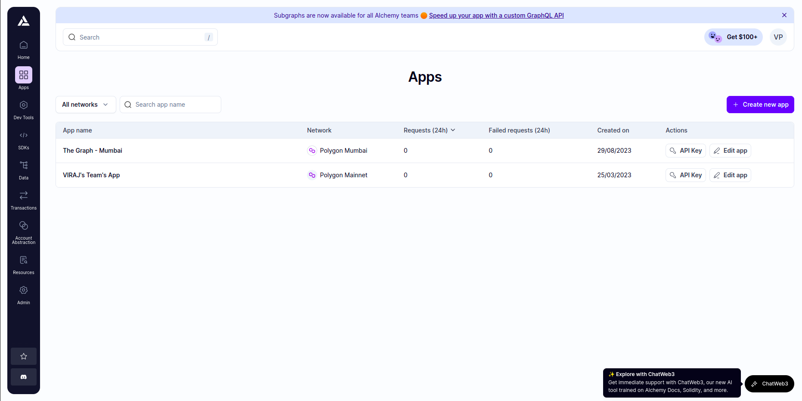
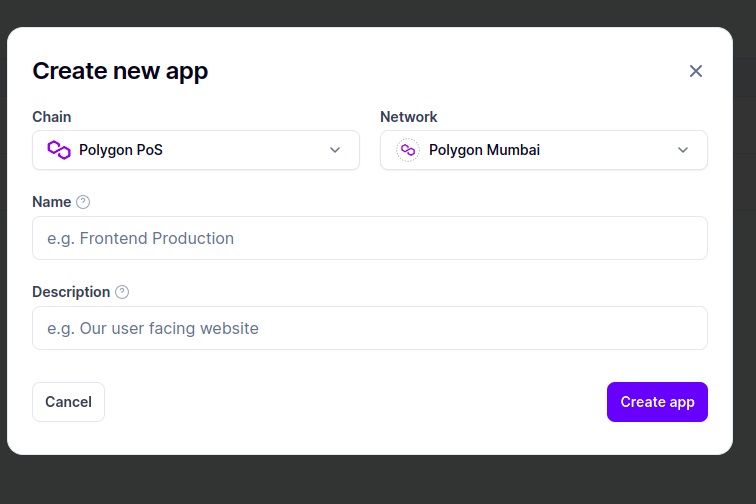
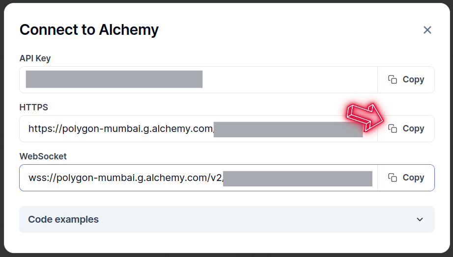

# Mumbai Testnet RPC URL Retrieval Guide

This guide provides step-by-step instructions on how to obtain the RPC URL for the Mumbai Testnet from Alchemy, a popular blockchain infrastructure provider.

## Prerequisites

1. **Alchemy Account**: Ensure that you have an active account on Alchemy. If not, sign up at [Alchemy](https://www.alchemy.com/) and log in.

2. **Project on Alchemy**: Create a new project on Alchemy or use an existing one. Each project on Alchemy corresponds to a unique set of API keys.

## Steps to Retrieve Mumbai Testnet RPC URL

### Step 1: Log in to Alchemy

Visit the [Alchemy website](https://www.alchemy.com/) and log in to your account.

### Step 2: Select or Create a Project

1. From the Alchemy Dashboard, select the project for which you want to obtain the Mumbai Testnet RPC URL.

2. If you don't have a project yet, go to [Application Page](https://dashboard.alchemy.com/apps) create one by clicking on the "Create new App" button.
 <p>
     
 </p>

Select following configuration to create application

<p>
    
</p>

### Step 3: Find Your Mumbai Testnet API Key

-   Click on the "API Key" button on the dashboard. We will use the HTTPs API Url from the pop-up.

 <p>
     
 </p>

```plaintext
https://rpc-mumbai.alchemyapi.io/v2/YOUR_MUMBAI_API_KEY
```

Keep you RPC Url handy, it will be used in the steps to setup the app on your system.

## Additional Notes

-   Keep your API keys secure. Do not share them publicly.
-   Ensure that your Alchemy project is funded to cover potential usage costs on the Mumbai Testnet.
-   If you encounter issues or have questions, refer to the Alchemy documentation or contact Alchemy support.

Feel free to reach out if you need further assistance or clarification. Happy coding!
