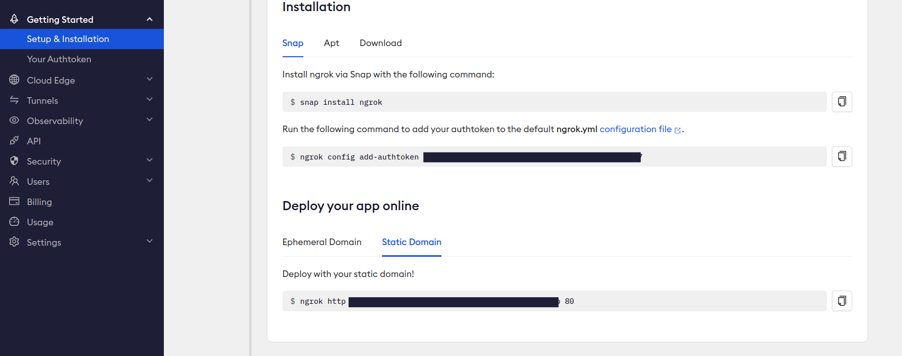

# Ngrok Setup Guide

This guide provides step-by-step instructions on how to set up and start Ngrok for exposing a local server on port 4007. Ngrok is a powerful tool that creates secure tunnels to localhost, allowing you to share your local development environment with others.

## 1. Getting Auth Token & Installing

### 1.1 Sign up for Ngrok Account

Visit the Ngrok website at [https://dashboard.ngrok.com/signup](https://dashboard.ngrok.com/signup) to create a Ngrok account. If you already have an account, you can skip this step.

### 1.2 Obtain Ngrok Auth Token

After signing up, log in to your Ngrok account, and navigate to the [Ngrok Auth page](https://dashboard.ngrok.com/get-started/your-authtoken). Here, you will find your unique Ngrok authentication token.

### 1.3 Install Ngrok

Download and install Ngrok by following the instructions provided on the [Ngrok download page](https://ngrok.com/download).

## 2. Set Auth Token

Open your terminal or command prompt and set your Ngrok authentication token using the following command from your dashboard:

<p>
    
</p>

-   Replace `YOUR_AUTH_TOKEN` with the token you obtained in Step 1.2.

-   Under `Deploy your app online` section on ngrok dashboard, click on `Static Domain`. This will give you a static domain to tunnel your local ports. Use the same command with port `4007` in the next step.

## 3. Start Ngrok on Port 4007

To expose your local server on port 4007, use the following command:

```bash
ngrok http --domain=your-domain.ngrok-free.app 4007
```

Ngrok will generate a public URL that you can share with others, allowing them to access your local server. The URL will be displayed in the terminal/command prompt.

-   For more advanced options and features, refer to the [Ngrok documentation](https://ngrok.com/docs).

Now you have successfully set up Ngrok and exposed your local server on port 4007. Share the Ngrok URL with others to provide them access to your development environment.
